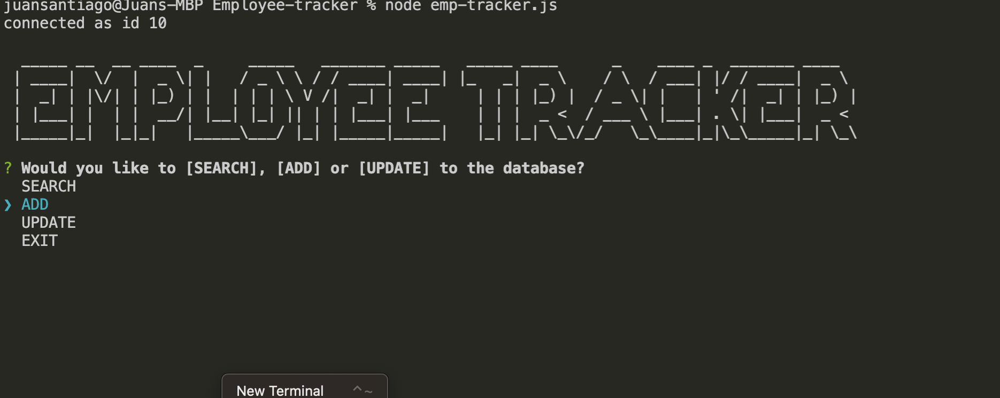

# Employee-Tracker-12 [](https://github.com/sindresorhus/awesome#readme)  

  ## Description  
  The Employee Tracker application is used to provide a user interface to non-IT personel at a company, it allows the user to query a sql database with multiple options for retrieving data and displays them on the page as a table 

  ## Table of Contents  
  - [Description](#description)
  - [Installation](#installation)  
  - [Usage](#usage)  
  - [License](#license)  
  - [Contributing](#contributing)  
  - [Questions](#questions) 
  - [Deployed Application](#deployed-application) 
 
  ## Installation  
  Use gitclone and the url provided from the repo to clone to the machine, after use npm i to install all the necessary packages  

  ```  
  gitclone <url>   
  npm i
  ```
  ## Usage  

  To use the application simply fork the repository over to your github or clone the current code to you machine and run the necessary commands to begin.  

  ```
    node emp-tracker.js
  ```

  ## License  
  [](https://opensource.org/licenses/MIT)

  ## Contributing  

  No Contributors yet  

  ## Questions  

  For questions, please email directly to me. (email not provided yet)   

  ## Deployed Application  

  [Link To Walkthrough Video](https://drive.google.com/file/d/1RqAUQFre8GLnhYzQZnBP4xDn5XHs8hIz/view)   
  
  *Start Screen*  
  